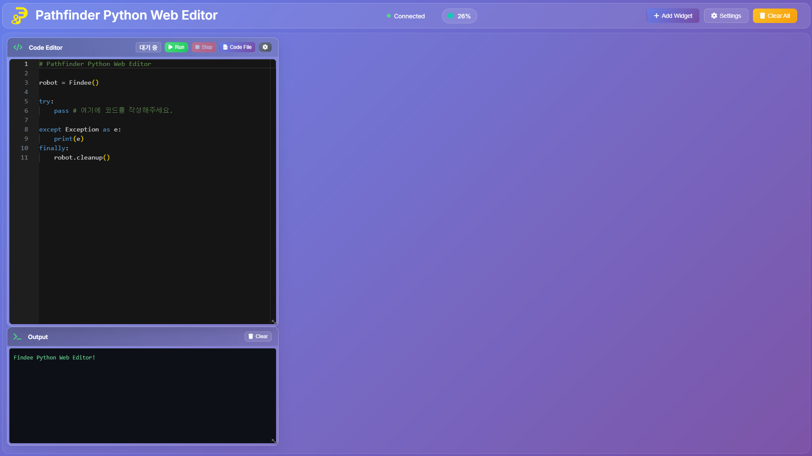
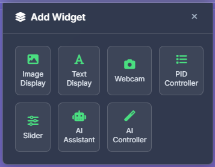

## PF Python Web Editor (Path Finder)

> 라즈베리파이 기반 파이썬 웹 에디터로, Findee 모듈을 통해 자율주행 자동차(모터/초음파/카메라)를 브라우저에서 코딩하고 실행합니다.


[](https://www.python.org/downloads/)
[](https://flask.palletsprojects.com/)
[](https://socket.io/)
[](https://www.raspberrypi.org/)

**Backend**: Python 3.8+, Flask 2.0+, Flask-SocketIO, psutil  
**Frontend**: Monaco Editor, GridStack, MediaPipe Tasks  
**Hardware**: Raspberry Pi Zero 2 W, Picamera2, RPi.GPIO  
**AI/ML**: Google Gemini API (선택사항)

---

## 목차
- [소개](#소개)
- [주요 특징](#주요-특징)
- [아키텍처](#아키텍처)
- [하드웨어 요구사항](#하드웨어-요구사항)
- [핀아웃(예시)](#핀아웃예시)
- [설치](#설치)
- [실행](#실행)
- [사용법](#사용법)
- [API 요약](#api-요약)
  - [Findee 제어 API(요약)](#findee-제어-api요약)
  - [웹 에디터 전용 Python 헬퍼](#웹-에디터-전용-python-헬퍼)
  - [REST 엔드포인트](#rest-엔드포인트)
  - [Socket.IO 이벤트](#socketio-이벤트)
- [프로젝트 구조](#프로젝트-구조)
- [개발/운영 팁](#개발운영-팁)
- [트러블슈팅](#트러블슈팅)
- [안전-주의사항](#안전-주의사항)
- [기여](#기여)
- [라이선스](#라이선스)

---

## 소개
- **목적**: 파이썬으로 AI 자율주행 자동차를 쉽고 빠르게 개발/실험
- **대상**: 라즈베리파이 제로 2 W + 모터 드라이버 + 초음파 센서 + 카메라(Picamera2)
- **구성**
  - 백엔드: Flask + Socket.IO (코드 실행/이미지·텍스트 스트리밍/상태 전송)
  - 프론트엔드: Monaco Editor, GridStack 기반 위젯(Image/Text/Webcam/Slider/PID/AI), 토스트/팝오버 UI
  - 제어 모듈: `from findee import Findee` 로 하드웨어 제어
  - LLM(선택): Gemini API 연동(질의/코드 생성 보조)
  - 제스처(선택): MediaPipe Tasks 기반 손 제스처(웹캠 → 서버로 상태 전달)

---

## 주요 특징
- **브라우저에서 코딩/실행**: Python 코드 작성 → Run → 실시간 출력/이미지 전송
- **위젯 시스템**: 이미지·텍스트·웹캠·슬라이더·PID·AI 위젯을 자유 배치
- **하드웨어 제어**: Findee API로 모터/초음파/카메라 제어
- **스트리밍**: `emit_image()`/`emit_text()`로 위젯에 실시간 표시
- **LLM 보조**: Gemini API Key 설정 시 AI Assistant/Controller 사용
- **파일 관리**: 코드 저장/불러오기(`static/custom_code/*.py`)
- **CPU 모니터/상태 표시**: 연결/실행/CPU 사용량 UI

---

## 🚀 Quick Start
1. **하드웨어 연결**: 모터 드라이버, 초음파 센서, 카메라 연결
2. **소프트웨어 설치**: `git clone https://github.com/Comrid/PF_PythonWebEditor` → `pip install -r requirements.txt`
3. **서버 실행**: `python app.py`
4. **브라우저 접속**: `http://<PI-IP>:5000`
5. **코드 실행**: 예제 코드 복사 → Run 버튼 클릭

### 웹 에디터 UI
> **참고**: 실제 스크린샷은 프로젝트 실행 후 확인 가능

- **Main Interface**: Monaco Editor + 위젯 그리드 레이아웃\


- **Widget System**: Image/Text/Webcam/Slider/PID/AI 위젯 배치\


---

## 아키텍처
- Flask 앱(`app.py`)이 브라우저와 **Socket.IO**로 양방향 통신
- 사용자 Python 코드 실행을 별도 스레드로 수행, `stdout/stderr`/이미지/텍스트를 이벤트로 반환
- 프론트는 **Monaco Editor** + **GridStack 위젯**으로 결과를 가시화
- (옵션) **MediaPipe** 손 제스처 → 서버 전달 → 사용자 코드에서 `get_gesture()`로 활용
- (옵션) **Gemini** API로 질의/코드 생성 보조

```
┌─────────────────┐    Socket.IO    ┌─────────────────┐
│   Browser       │ ←────────────→  │   Flask Server  │
│                 │                 │   (app.py)      │
│ ┌─────────────┐ │                 │                 │
│ │Monaco Editor│ │                 │ ┌─────────────┐ │
│ └─────────────┘ │                 │ │Code Executor│ │
│ ┌─────────────┐ │                 │ │(Thread)     │ │
│ │GridStack    │ │                 │ └─────────────┘ │
│ │Widgets      │ │                 │                 │
│ └─────────────┘ │                 │ ┌─────────────┐ │
└─────────────────┘                 │ │Findee       │ │
                                    │ │Hardware     │ │
                                    │ │Control      │ │
                                    │ └─────────────┘ │
                                    └─────────────────┘
```

```
┌─────────────────────────────────────────────────────────────┐
│                    Frontend (Browser)                       │
├─────────────────────────────────────────────────────────────┤
│  Monaco Editor  │  GridStack Widgets  │  Popover/Toast      │
│  (Code Input)   │  (Image/Text/Webcam │  (Settings/UI)      │
│                 │   /Slider/PID/AI)   │                     │
└─────────────────┼─────────────────────┼─────────────────────┘
                  │                     │
                  ▼                     ▼
┌─────────────────────────────────────────────────────────────┐
│                 Backend (Flask + Socket.IO)                 │
├─────────────────────────────────────────────────────────────┤
│  Code Execution │  Hardware Control   │  File Management    │
│  (Threading)    │  (Findee Module)    │  (Save/Load)        │
└─────────────────┼─────────────────────┼─────────────────────┘
                  │                     │
                  ▼                     ▼
┌─────────────────────────────────────────────────────────────┐
│                    Hardware Layer                           │
├─────────────────────────────────────────────────────────────┤
│  Motors  │  Ultrasonic  │  Camera    │  GPIO Control        │
│  (L298N) │  (HC-SR04)   │(Picamera2) │  (RPi.GPIO)          │
└─────────────────────────────────────────────────────────────┘
```


---

## 하드웨어 요구사항
- Raspberry Pi Zero 2 W (또는 호환 Pi)
- 모터 드라이버(L298N 등), DC 모터 2개
- HC-SR04(유사) 초음파 센서
- 카메라 모듈(Picamera2 호환)
- 배선 점검 및 충분한 전원(모터 드라이버 별도 전원 권장)

---

## 핀아웃(예시)
> Findee 기본 핀(BCM 기준). 필요 시 `changePin()`으로 변경 가능.
- 모터:
  - 오른쪽: IN1=23, IN2=24, ENA=12(PWM)
  - 왼쪽: IN3=22, IN4=27, ENB=13(PWM)
- 초음파: TRIG=5, ECHO=6

| 기능 | 핀(BCM) |
|---|---|
| Right IN1/IN2 | 23 / 24 |
| Right ENA(PWM) | 12 |
| Left IN3/IN4 | 22 / 27 |
| Left ENB(PWM) | 13 |
| Ultrasonic TRIG/ECHO | 5 / 6 |

```
Motor Driver (L298N)    Ultrasonic    Camera
    ┌─────────┐         ┌─────────┐   ┌─────────┐
    │ IN1(23) │         │ TRIG(5) │   │         │
    │ IN2(24) │         │ ECHO(6) │   │ Picamera│
    │ ENA(12) │         └─────────┘   │   2     │
    │ IN3(22) │                       └─────────┘
    │ IN4(27) │
    │ ENB(13) │
    └─────────┘
```

---

## 설치
### 1) 라즈베리파이 준비
- 최신 Raspberry Pi OS (Bookworm 권장), 카메라 모듈 장착
- 카메라 및 인터페이스 활성화:
```bash
sudo raspi-config nonint do_camera 0
sudo raspi-config nonint do_legacy 0
```
- 재부팅 후 libcamera/Picamera2 동작 확인

### 2) 프로젝트 클론 및 의존성
```bash
git clone https://github.com/Comrid/PF_PythonWebEditor.git
cd PF_PythonWebEditor

# 가상환경(권장)
python3 -m venv .venv
source .venv/bin/activate

# 시스템 의존성 (필요시)
sudo apt install python3-picamera2 python3-opencv python3-pip

# Python 의존성
pip install -r requirements.txt
```

### 3) Findee 모듈
```python
from findee import Findee
```
- PyPI에 게시된 `findee` 모듈 사용을 가정합니다.
- 속도/토크 특성상 `speed`는 20~100 권장.

### 4) (옵션) Gemini API 키
- 브라우저 UI(톱니 → Editor Settings)에서 입력/저장하거나, 환경변수로 노출:
```bash
export GEMINI_API_KEY="YOUR_GEMINI_API_KEY"
```

---

## 실행
```bash
python app.py
```
- 기본 포트: `5000`
- 접속: `http://<라즈베리파이 IP>:5000`
- 비Linux(개발 PC)에서는 하드웨어가 비활성화된 **DEBUG 모드**로 프론트/UI 테스트 가능

---

## 사용법
### 1) 위젯 추가
- 헤더의 Add Widget → Image/Text/Webcam/Slider/PID/AI
- 각 위젯의 ID는 코드에서 참조(예: `"Image_0"`, `"Text_0"`)

### 2) 코드 작성/실행
- Code Editor에 Python 코드 작성 → Run → Output/위젯으로 결과 확인

#### 기본 템플릿
```python
from findee import Findee

robot = Findee()
try:
    # 코드를 작성하세요
    pass
except Exception as e:
    print(e)
finally:
    robot.cleanup()
```

#### 카메라 예제
```python
import time
from findee import Findee

robot = Findee()
fps = 30
interval = 1 / fps

try:
    while True:
        frame = robot.get_frame()      # np.ndarray (H,W,3)
        emit_image(frame, "Image_0")   # 이미지 위젯으로 전송
        time.sleep(interval)
finally:
    robot.cleanup()
```

#### 모터/초음파 예제
```python
from findee import Findee

robot = Findee()
try:
    robot.move_forward(70, 1.0)   # 70% 속도로 1초 전진(자동 정지 포함)
    d = robot.get_distance()      # cm; -1/-2는 타임아웃 코드
    emit_text(f"Distance: {d}cm", "Text_0")
finally:
    robot.cleanup()
```

### 3) LLM 위젯
- AI Assistant: 질문/설명(코드 기반 참고 토글 가능)
- AI Controller: 자연어 요구사항 → 코드 생성(옵션 Auto Run)
- Editor Settings에서 Gemini API Key 입력 필요

### 4) 실제 사용 시나리오
- **라인 트레이서**: 카메라로 라인 인식 → 모터 제어
- **장애물 회피**: 초음파 센서 → 거리 측정 → 경로 계획
- **제스처 제어**: 손 제스처 → 모터 동작
- **자율 주행**: 센서 데이터 융합 → AI 기반 의사결정

---

## API 요약
### Findee 제어 API(요약)
- 모터:
  - `move_forward(speed, duration=0.0)`
  - `move_backward(speed, duration=0.0)`
  - `turn_left(speed, duration=0.0)`, `turn_right(speed, duration=0.0)`
  - `curve_left(speed, angle, duration=0.0)`, `curve_right(speed, angle, duration=0.0)`  // angle 0~60
  - `stop()`
- 센서: `get_distance() -> float`  // cm, -1(Trig timeout), -2(Echo timeout)
- 카메라: `get_frame() -> np.ndarray`  // RGB 프레임

권장: `speed`는 20~100, `duration>0`이면 자동 정지 포함(별도 `sleep` 불필요).

### 웹 에디터 전용 Python 헬퍼
- `emit_image(image, widget_id)`: numpy 배열 이미지를 해당 이미지 위젯에 표시(JPEG 변환 전송)
- `emit_text(text, widget_id)`: 텍스트 위젯에 표시
- `get_gesture()`: 최신 손 제스처 상태 반환
- `get_pid_value(widget_id) -> (p,i,d)`
- `get_slider_value(widget_id) -> float | list[float]`

### REST 엔드포인트
- `GET /api/cpu-usage`: CPU 전체/코어별 사용량
- `GET /api/custom-code/files`: 저장 코드 목록
- `POST /api/custom-code/save`: `{ filename, code }` 저장
- `GET /api/custom-code/load/<filename>`: 코드 로드
- `DELETE /api/custom-code/delete/<filename>`: 코드 삭제
- `GET /api/tutorial/progress`: 튜토리얼 진행상황 조회
- `POST /api/tutorial/progress`: 튜토리얼 진행상황 저장/업데이트
- `POST /api/tutorial/reset`: 튜토리얼 데이터베이스 초기화

### Socket.IO 이벤트
- 클라이언트→서버: `execute_code`, `stop_execution`, `pid_update`, `slider_update`, `gesture_update`
- 서버→클라이언트: `execution_started`, `execution_stopped`, `finished`, `stdout`, `stderr`, `image_data`, `text_data`

---

## 프로젝트 구조
```text
PF_PythonWebEditor/
├─ app.py                # Flask + Socket.IO 서버, 코드 실행/브리지, CPU API
├─ templates/
│  └─ index.html         # 메인 웹 UI(위젯/팝오버/에디터 포함)
├─ static/
│  ├─ css/               # base.css, editor.css, popover.css, new.css
│  ├─ js/
│  │  ├─ util.js         # 전역 상태/토스트/예제 코드/디바이스 탐색
│  │  ├─ editor.js       # Monaco Editor 로드/설정
│  │  ├─ widget.js       # GridStack 위젯(이미지/텍스트/웹캠/슬라이더/PID/AI)
│  │  ├─ hand_gesture.js # MediaPipe 제스처(지연 로드/오버레이/이벤트 전송)
│  │  ├─ llm.js          # Gemini API 연동(상태/질의/스트리밍 흉내)
│  │  ├─ action.js       # Run/Stop/파일 관리 버튼 핸들러
│  │  ├─ socket-handler.js# 소켓 이벤트 바인딩/출력/이미지/텍스트 수신
│  │  ├─ popover.js      # 설정/파일/웹캠 팝오버 로직
│  │  └─ new.js          # CPU 모니터 UI
│  ├─ img/app-logo.png
│  └─ custom_code/       # 사용자 저장 코드(.py)
├─ blueprints/
│  ├─ custom_code_bp.py  # 코드 저장/불러오기 API
│  └─ tutorial_bp.py     # 튜토리얼 진행상황 관리 API
├─ requirements.txt
├─ LICENSE
└─ findee (PyPI 모듈 사용 가정)
```

---

## 개발/운영 팁
### 개발 환경
- **비Linux 환경**: `app.py`가 **DEBUG 모드**로 실행되어 프론트/에디터/UI 테스트 가능 (하드웨어 제어는 비활성)
- **VS Code 설정**: Python 확장, 디버깅 설정, Python 인터프리터 경로 설정 권장
- **가상환경**: 프로젝트별 가상환경 사용으로 의존성 충돌 방지

### 코드 구조
- **Blueprint 패턴**: API 기능별로 `blueprints/` 디렉토리에 모듈화
  - `custom_code_bp.py`: 코드 저장/불러오기 API
  - `tutorial_bp.py`: 튜토리얼 진행상황 관리 API
- **모듈화**: 각 blueprint는 독립적인 기능을 담당하며 URL prefix로 구분

### 운영 관련
- **코드 실행**: 별도 스레드에서 이루어지며, `Stop` 버튼으로 중지 신호 전송 → 필요 시 강제 종료 루틴 수행
- **이미지 전송**: 서버에서 JPEG 인코딩(품질 기본 70) 후 바이너리로 소켓 전송
- **로그 확인**: 서버 콘솔에서 실행 상태 및 오류 메시지 모니터링
- **성능 최적화**: 프레임레이트 조절, 이미지 품질 조정으로 네트워크 부하 감소

---

## 트러블슈팅
### 하드웨어 관련
- **모터가 움직이지 않음**
  - 배선/전원 점검, 핀번호 확인, `speed>=20` 권장
  - 모터 드라이버 전원 공급 확인 (5V/12V)
- **초음파가 -1/-2 반환**
  - TRIG/ECHO 배선/거리/타이밍 확인
  - 센서와 물체 간 거리 (2cm~400cm 권장)

### 소프트웨어 관련
- **웹캠/카메라가 보이지 않음**
  - 브라우저 권한 허용, HTTPS 또는 `localhost/PI-IP` 접속
  - Picamera2/케이블/포트 점검, 다른 앱 점유 해제
- **이미지 프레임이 느림**
  - 네트워크/CPU 점유 확인, 프레임레이트(딜레이) 조절
- **소켓 연결 실패**
  - 방화벽/프록시 점검, 브라우저 콘솔/서버 로그 확인

### 일반적인 문제
- **ImportError: No module named 'findee'**
  - `pip install findee` 또는 올바른 경로에 모듈 설치 확인
- **Permission denied (GPIO)**
  - `sudo` 권한으로 실행하거나 GPIO 그룹에 사용자 추가

---

## 안전-주의사항
- 초기 구동은 바퀴가 공중에 뜬 상태 등 안전 환경에서 테스트
- 모터 드라이버 전원/접지 공통(GND) 확인
- 네트워크 공개 시 방화벽/접속 통제 등 보안 조치 권장

---

## 기여
- 이슈 등록 → 브랜치 생성 → PR 제출
- 코드 스타일: 가독성 우선, 명확한 네이밍, 예외/에러 처리 철저
- 대규모 변경은 이슈로 사전 논의 권장

---

## 라이선스
- 저장소의 `LICENSE` 파일을 참조하세요.

---

## Requirements.txt
```txt
# Web Framework
Flask==2.3.3
Werkzeug==2.3.7
Flask-SocketIO==5.3.6

# System Monitoring
psutil==5.9.6

# Socket.IO Dependencies
eventlet

# Computer Vision
opencv-python==4.8.1.78
numpy==1.24.3

# Note: RPi.GPIO, picamera2 등 하드웨어 관련 패키지는 
# 라즈베리파이 환경에서 별도 설치 필요
```